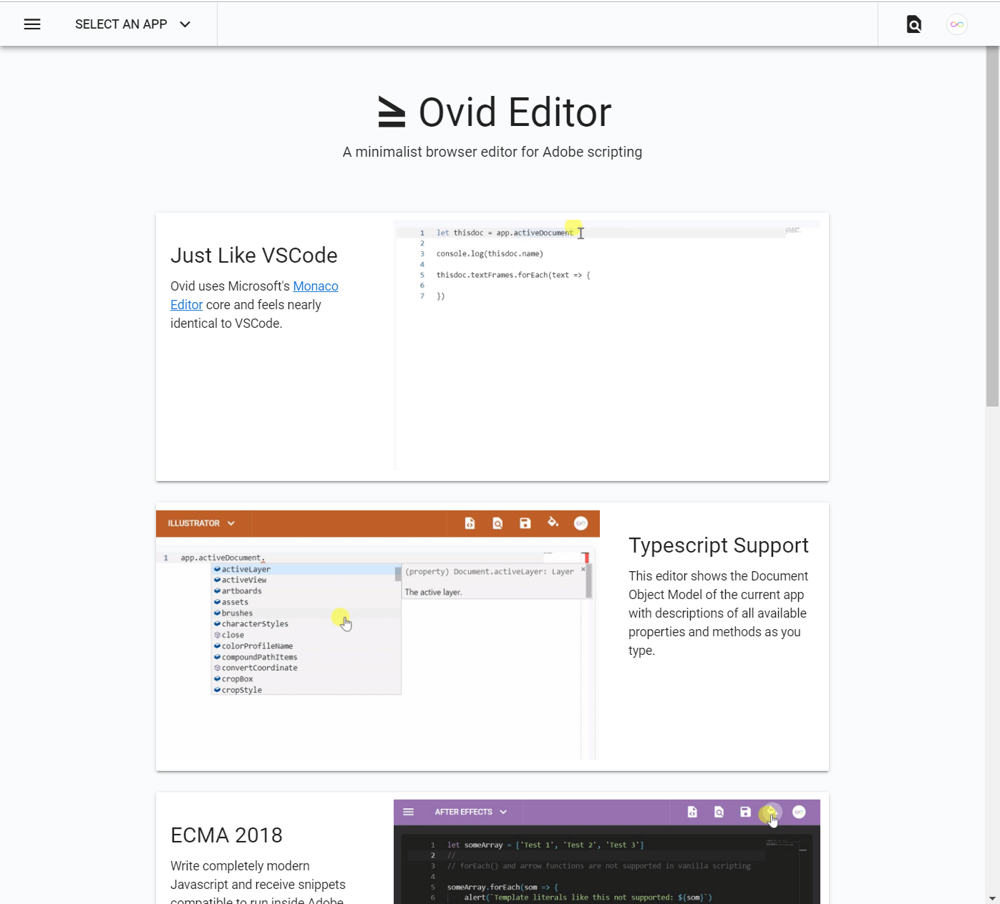

# Ovid Web

Minimalist browser rebuild of [Ovid-Editor](https://github.com/Inventsable/ovid-editor):

## Dynamic Typescript Support:

## Firebase backend for URL links to snippets:

## Contextual links to scripting resources:

## Todo

- Migrate to TextMate grammars (like VSCode uses) to be able to support any VSCode theme and extended syntax highlighting. In doing this, we lose the current Typescript implementation and will need to figure out how to re-implement them -- between the balance of proper syntax highlighting and Typescript, I've leaned towards Typescript for the initial build.
- Finish `Add Note` dialog and extended functions
- Add support for more ECMA2018 methods via `@babel/standalone` plugins, should be as easy as adding them in [from this link](https://babeljs.io/docs/en/plugins) and gauging what users actually want/need.
- My Snippet History list for current user, expand User Menu and potentially add more OAuth providers beyond just Google and Github
- 404 Page
- Roll a Random Snippet function for easy samples of scripting
